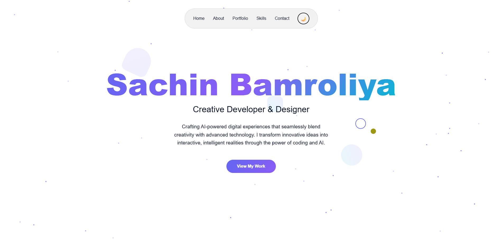

# Sachin Bamroliya - Creative Portfolio

A modern, responsive personal portfolio website to showcase your skills, projects, and contact details. Built with HTML, CSS, and JavaScript, this portfolio features smooth animations, dark/light mode, and mobile responsiveness.



## Features

- Responsive design for all devices
- Smooth scroll and animated transitions
- Custom cursor and interactive UI
- Dark and light mode toggle
- Animated skill bars and project cards
- Contact form (front-end only)
- Modern, glassmorphism-inspired UI

## Getting Started

1. **Clone the repository:**
   ```sh
   git clone https://github.com/yourusername/your-portfolio-repo.git
   cd your-portfolio-repo
   ```
2. **Open `SACHIN.html` in your browser.**

No build tools or frameworks required. All assets are included in the `images/` folder.

## Folder Structure

```
├── SACHIN.html
├── images/
│   ├── pfp.jpg         # Profile photo
│   ├── s1.png          # Project 1 screenshot
│   ├── s2.png          # Project 2 screenshot
│   └── s3.png          # Project 3 screenshot
```

## Customization

- Replace images in the `images/` folder with your own.
- Edit `SACHIN.html` to update your name, about section, projects, and contact info.
- Update project images and descriptions as needed.

## License

This project is licensed under the MIT License. See the [LICENSE](LICENSE) file for details.

## Author

[Sachin Bamroliya](mailto:contact.devsachin@gmail.com)

---

Feel free to fork, customize, and use this portfolio as your own!
